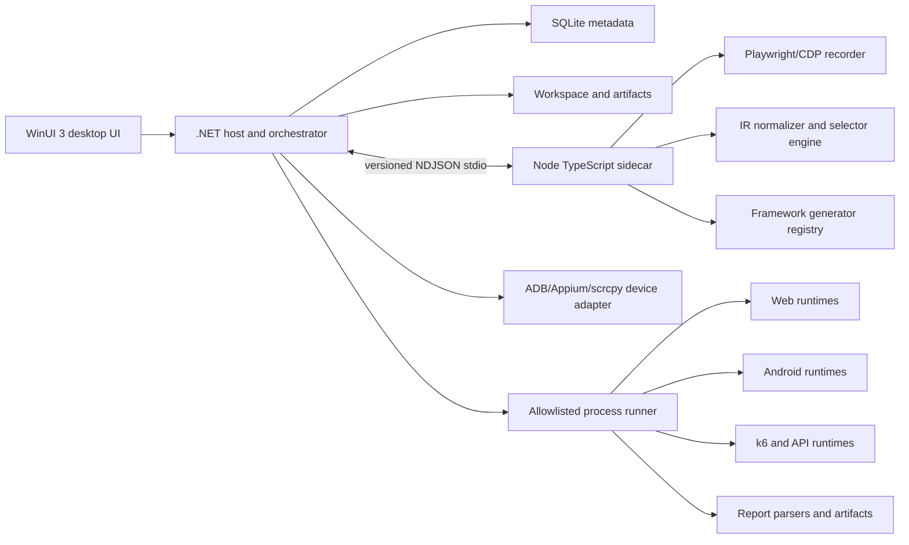
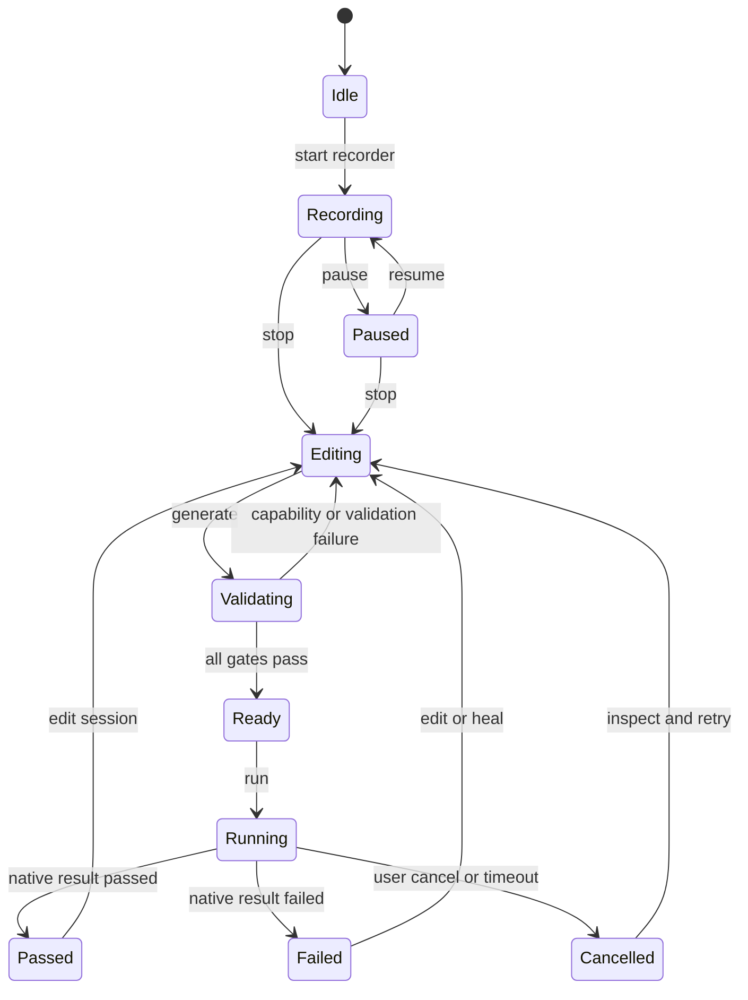
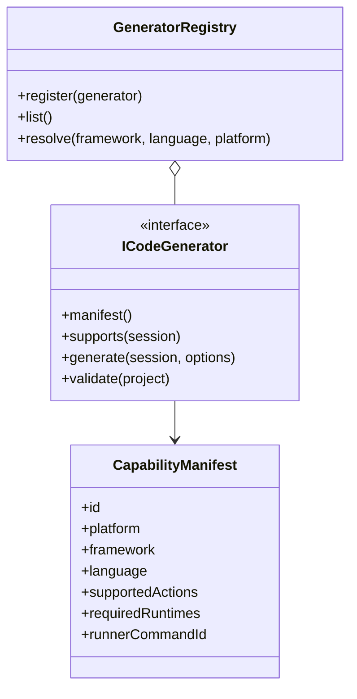

# AutomatePlus System and Technical Design

**Design version:** 2.0.0  
**Status:** Proposed implementation contract  
**Target OS:** Windows 10/11 x64  
**Desktop shell:** WinUI 3 + .NET 8  
**Automation sidecar:** Node.js/TypeScript  
**Persistence:** SQLite metadata plus workspace files  
**Connectivity:** Local-first; no required cloud service

This document is the technical source of truth for the requirements in `PRD.md`. It defines boundaries, contracts, state transitions, data ownership, security controls, and verification gates. It does not claim that the current Vite scaffold is production-ready.

## 1. Architecture decisions

### ADR-01 — WinUI/.NET host with TypeScript sidecar

AutomatePlus uses a hybrid desktop architecture:

- WinUI 3 and .NET 8 own the Windows application shell, MVVM state, orchestration, SQLite, runtime management, process isolation, device locks, cancellation, and normalized reports.
- A long-lived Node.js/TypeScript sidecar owns Automation IR validation/normalization, selector scoring, Playwright/CDP Web recording, and framework generator adapters.
- Target frameworks and tools run as separate local processes selected from a verified runtime manifest.
- The sidecar is never loaded into the WinUI UI process and the Web target is never granted privileged host APIs.

The existing TypeScript packages are treated as a migration source for the sidecar. They are not a reason to keep browser-only UI code in production or to expose Node APIs to a renderer.

### ADR-02 — NDJSON over redirected stdio

The .NET host launches the sidecar with an explicit executable path and argument array. Requests, responses, and events use newline-delimited JSON over stdin/stdout. stderr is diagnostics only.

This avoids a network listener, keeps the default trust boundary local, supports streaming recorder events, and permits deterministic process-tree cleanup.

### ADR-03 — IR is the only cross-framework source of truth

Recorders produce raw events, the normalizer produces IR, and generators consume IR. A recorder never emits framework code and a generator never reaches into a recorder implementation.

### ADR-04 — RPS is protocol-level

Browser and Android sessions can be functionally looped or soaked with bounded workers. Only API/HTTP traffic is called RPS and is executed through k6's arrival-rate model.

## 2. Process and module topology



### 2.1 Ownership matrix

| Concern | .NET host | TypeScript sidecar | Target runtime |
|---|---|---|---|
| Window, navigation, MVVM | Owner | None | None |
| Session orchestration | Owner | Stateless operations | None |
| SQLite and migrations | Owner | No direct database access | None |
| IR schema and normalization | Contract owner; validates envelope | Implements schema, reducer, and migration helpers | None |
| Web recording | Lifecycle and security owner | Playwright/CDP adapter | Chromium/Playwright |
| Locator scoring | Invokes service | Scoring implementation | DOM/UI hierarchy source |
| Android discovery/lock | Owner | Receives normalized candidates | ADB/Appium/scrcpy |
| Code generation | Stores and validates result | Registry and adapters | Formatter/linter/compiler |
| Process execution | Owner | No unrestricted process spawning | Node/Python/JVM/k6/framework CLI |
| Report normalization | Owner | Emits adapter metadata | Native report producer |

### 2.2 Proposed solution layout

```text
AutomatePlus/
├─ AutomatePlus.sln
├─ src/
│  ├─ AutomatePlus.App/              # WinUI 3, views, view-models, composition root
│  ├─ AutomatePlus.Application/      # use cases, orchestration, ports, DTO mapping
│  ├─ AutomatePlus.Domain/           # session, IR envelope, capabilities, run states
│  ├─ AutomatePlus.Infrastructure/   # SQLite, DPAPI, process, ADB, reports, files
│  └─ AutomatePlus.SidecarHost/      # NDJSON client and sidecar lifecycle
├─ sidecar/
│  ├─ package.json
│  ├─ src/ir/                         # Zod schema, normalizer, migrations
│  ├─ src/recorders/web/              # Playwright/CDP recorder
│  ├─ src/selectors/                  # locator candidates and scoring
│  └─ src/generators/                 # adapter registry and emitters
├─ contracts/
│  ├─ automation-ir.schema.json
│  ├─ sidecar-protocol.schema.json
│  └─ capability-manifest.schema.json
├─ fixtures/
│  ├─ web-local/
│  ├─ api-local/
│  └─ android-test-app/
├─ runtime-packs/
├─ templates/
├─ tests/golden/
└─ docs/
```

The current `apps/desktop` and `packages/*` tree is a prototype/migration input. It must not be bundled as a browser UI with Node-only dependencies in the production WinUI renderer.

## 3. Application state machines

### 3.1 Session lifecycle



### 3.2 Run states

`Queued → Preflight → Generating → Formatting → Linting → Compiling → SmokeValidating → Running → Passed|Failed|Cancelled|Blocked`.

`Blocked` is reserved for missing runtime, missing Android device, missing Android Gradle project, invalid capability, invalid workspace, or a security policy rejection. It is not a disguised pass or a fallback run.

### 3.3 Remediation policy

- A failed preflight or run may be remediated at most three times.
- Two identical consecutive errors stop the retry loop immediately.
- A healed selector is recorded as `HEALED`, with the original locator, selected fallback, confidence, and evidence.
- Self-healing never mutates the saved session automatically; the user must accept a locator change.

## 4. Public contracts

The JSON schemas under `contracts/` are the cross-language source of truth. C# DTOs and TypeScript types must be generated or reviewed against the same schema version.

### 4.1 Core IR types

```typescript
type Platform = 'web' | 'android' | 'api';
type SecretRef = { kind: 'secret'; key: string };

interface LocatorCandidate {
  strategy:
    | 'testId' | 'role' | 'accessibilityId' | 'resourceId'
    | 'label' | 'id' | 'name' | 'text' | 'css' | 'xpath' | 'bounds';
  value: string;
  score: number;
  role?: string;
  name?: string;
  unique?: boolean;
  source?: 'dom' | 'uiautomator' | 'appium' | 'manual';
}

interface ActionIR {
  schemaVersion: 1;
  id: string;
  stepNumber: number;
  platform: Platform;
  action: string;
  target?: {
    locators: LocatorCandidate[];
    coordinates?: { x: number; y: number };
    framePath?: number[];
    pageId?: string;
  };
  value?: string | SecretRef;
  payload?: Record<string, unknown>;
  assertions?: Array<Record<string, unknown>>;
  variables?: Array<{ name: string; source: string }>;
  timeoutMs?: number;
  explicitSleepMs?: number;
  metadata: {
    recordedAt: string;
    source: 'web-recorder' | 'android-recorder' | 'api-builder' | 'manual';
    durationMs?: number;
    screenshotPath?: string;
  };
}

interface AutomationSession {
  schemaVersion: 1;
  id: string;
  projectId: string;
  name: string;
  platform: Platform;
  target: Record<string, unknown>;
  environment: Record<string, string | SecretRef>;
  steps: ActionIR[];
  createdAt: string;
  updatedAt: string;
}
```

Required schema invariants:

- IDs are UUIDs and step numbers are unique, positive, and contiguous after edits.
- `platform` and action payload must agree.
- Secrets are references, never resolved values.
- Locators are ranked descending by score; coordinate/bounds fallback is explicit.
- Unknown schema versions are blocked until a migration is available.
- Every persisted action identifies its source and recording timestamp.

### 4.2 Capability manifest

```typescript
interface CapabilityManifest {
  id: string;
  platform: 'web' | 'android' | 'api';
  framework: string;
  language: string;
  outputFormat: 'typescript' | 'javascript' | 'python' | 'java' | 'kotlin' | 'robot' | 'yaml';
  supportedActions: string[];
  supportedAssertions: string[];
  requiredRuntimes: string[];
  requiresProject?: 'android-gradle' | 'none';
  runnerCommandId: string;
  version: string;
}
```

The registry is the sole source for framework/language selection. A descriptor must be present before a generator is visible in the UI.

### 4.3 Generator and runner ports

```typescript
interface ICodeGenerator {
  readonly manifest: CapabilityManifest;
  supports(session: AutomationSession): CapabilityResult;
  generate(session: AutomationSession, options: GenerateOptions): Promise<GeneratedProject>;
  validate(project: GeneratedProject): Promise<ValidationResult>;
}

interface GeneratedProject {
  framework: string;
  language: string;
  rootRelativePath: string;
  files: Array<{ relativePath: string; content: string; language: string }>;
  runtimeRequirements: string[];
  checksums: Record<string, string>;
}

interface IRecorder {
  start(options: RecorderOptions): AsyncIterable<RecorderEvent>;
  pause(): Promise<void>;
  resume(): Promise<void>;
  stop(): Promise<void>;
}

interface ITestRunner {
  preflight(project: GeneratedProject, options: RunOptions): Promise<PreflightResult>;
  run(project: GeneratedProject, options: RunOptions): AsyncIterable<RunEvent>;
  cancel(runId: string): Promise<void>;
}

interface IToolchainResolver {
  health(): Promise<ToolchainHealth[]>;
  resolve(id: string): Promise<ResolvedToolchain>;
  verifyPack(manifestPath: string): Promise<PackVerification>;
}

interface IReportNormalizer {
  canParse(path: string): boolean;
  parse(path: string): Promise<NormalizedReport>;
}
```

The equivalent .NET ports use immutable records and `IAsyncEnumerable<T>` for streaming events. Domain projects depend on interfaces, not concrete Node, ADB, or framework classes.

### 4.4 Run options and events

```typescript
type RunMode = 'functional' | 'ui-soak' | 'api-rps';

interface RunOptions {
  mode: RunMode;
  iterations?: number;
  workers?: number;
  delayMs?: number;
  targetRps?: number;
  durationSeconds?: number;
  maxVus?: number;
  environment: Record<string, string | SecretRef>;
  headless?: boolean;
}

interface RunEvent {
  runId: string;
  timestamp: string;
  kind: 'state' | 'stdout' | 'stderr' | 'step' | 'metric' | 'artifact' | 'error';
  stepId?: string;
  status?: string;
  message?: string;
  data?: Record<string, unknown>;
}
```

## 5. NDJSON sidecar protocol

Every line is one complete JSON object. The host rejects lines larger than the configured limit, malformed JSON, unknown protocol versions, and responses with an unknown correlation ID.

```json
{
  "protocolVersion": 1,
  "correlationId": "7d73c1c6-3db8-42b9-8c1f-f84db4d6d4e1",
  "kind": "request",
  "method": "generator.generate",
  "timestamp": "2026-08-16T12:00:00Z",
  "payload": {
    "sessionId": "session-uuid",
    "framework": "playwright",
    "language": "typescript"
  }
}
```

Response envelope:

```json
{
  "protocolVersion": 1,
  "correlationId": "7d73c1c6-3db8-42b9-8c1f-f84db4d6d4e1",
  "kind": "response",
  "ok": false,
  "error": {
    "code": "CAPABILITY_ERROR",
    "message": "The selected adapter does not support action 'pinch'.",
    "details": { "framework": "cypress", "language": "typescript" }
  }
}
```

Event methods use the same envelope with `kind: "event"` and include recorder, generator, or diagnostic events. The host sends cancellation as a correlated request and kills the sidecar if the grace period expires.

Allowed sidecar methods:

| Method | Purpose |
|---|---|
| `health.check` | Return sidecar version, schema version, and capabilities |
| `session.validate` | Validate and migrate an IR session |
| `session.normalize` | Reduce raw events into canonical IR |
| `selector.rank` | Rank Web or Android locator candidates |
| `recorder.web.start` | Start Playwright/CDP recording |
| `recorder.web.stop` | Stop recording and return final recorder state |
| `generator.list` | Return capability manifests |
| `generator.generate` | Generate a project from a validated session |
| `generator.validate` | Validate generated project metadata before .NET runner gates |

## 6. Persistence and workspace

### 6.1 SQLite ownership

The .NET infrastructure layer owns migrations, transactions, and repositories. IR JSON is stored with a schema version for reproducibility; frequently queried run metadata is relational.

```sql
CREATE TABLE projects (
  id TEXT PRIMARY KEY,
  name TEXT NOT NULL,
  workspace_path TEXT NOT NULL,
  description TEXT,
  created_at TEXT NOT NULL,
  updated_at TEXT NOT NULL
);

CREATE TABLE sessions (
  id TEXT PRIMARY KEY,
  project_id TEXT NOT NULL REFERENCES projects(id) ON DELETE CASCADE,
  name TEXT NOT NULL,
  platform TEXT NOT NULL CHECK (platform IN ('web','android','api')),
  schema_version INTEGER NOT NULL,
  ir_json TEXT NOT NULL,
  created_at TEXT NOT NULL,
  updated_at TEXT NOT NULL
);

CREATE TABLE runs (
  id TEXT PRIMARY KEY,
  session_id TEXT NOT NULL REFERENCES sessions(id) ON DELETE CASCADE,
  mode TEXT NOT NULL CHECK (mode IN ('functional','ui-soak','api-rps')),
  framework TEXT NOT NULL,
  language TEXT NOT NULL,
  status TEXT NOT NULL,
  started_at TEXT,
  finished_at TEXT,
  summary_json TEXT
);

CREATE TABLE artifacts (
  id TEXT PRIMARY KEY,
  run_id TEXT NOT NULL REFERENCES runs(id) ON DELETE CASCADE,
  kind TEXT NOT NULL,
  relative_path TEXT NOT NULL,
  sha256 TEXT NOT NULL,
  created_at TEXT NOT NULL
);

CREATE TABLE metrics (
  id TEXT PRIMARY KEY,
  run_id TEXT NOT NULL REFERENCES runs(id) ON DELETE CASCADE,
  name TEXT NOT NULL,
  value REAL NOT NULL,
  unit TEXT NOT NULL,
  timestamp TEXT NOT NULL
);

CREATE TABLE runtime_packs (
  id TEXT PRIMARY KEY,
  version TEXT NOT NULL,
  root_path TEXT NOT NULL,
  sha256 TEXT NOT NULL,
  license_status TEXT NOT NULL,
  health_json TEXT NOT NULL,
  verified_at TEXT
);
```

Secrets are not stored in SQLite. The database stores a `SecretRef`; values are resolved only at execution boundaries through DPAPI or Windows Credential Manager.

### 6.2 Workspace layout

```text
<project-workspace>/
├─ automate-plus.db
├─ sessions/
│  └─ <session-id>/
│     ├─ session.json
│     ├─ recordings/
│     └─ generated/
├─ runs/
│  └─ <run-id>/
│     ├─ stdout.log
│     ├─ stderr.log
│     ├─ report.json
│     ├─ report.html
│     ├─ screenshots/
│     ├─ traces/
│     ├─ videos/
│     └─ metrics/
└─ runtime-locks/
```

All paths are resolved against a canonical workspace root. Absolute paths supplied by users are allowed only after explicit selection and validation; generated paths cannot escape the project root.

## 7. Recorder design

### 7.1 Web recorder

```text
WinUI command
  → .NET sidecar host
  → Node Playwright worker
  → isolated headed Chromium
  → injected event collector
  → raw event
  → debounce and normalize
  → locator scoring
  → ActionIR event
  → .NET persistence/UI timeline
```

Rules:

- Chromium runs in a separate browser process/context and never receives Node filesystem APIs.
- Capture listeners observe click, dblclick, context menu, input/change, keydown, wheel, pointer/drag events, navigation, popup, download, dialog, and file chooser.
- The recorder waits for an input/change settling window before emitting one `fill` action.
- Wheel bursts are accumulated into one scroll action with delta and duration metadata.
- Each event includes page ID, frame path, target fingerprint, candidate locators, and optional screenshot.
- Assertions are user-requested through the UI; the recorder must not guess business assertions from every click.
- New tabs/pages are tracked by page ID and generated code targets the correct page/context.

Locator priority:

```text
data-testid/test attribute
→ role + accessible name
→ aria-label/accessibility ID
→ associated label
→ stable id/name/resource metadata
→ stable visible text
→ scoped CSS
→ XPath
→ coordinate fallback
```

The selector engine checks uniqueness where a live DOM is available. Dynamic classes, timestamps, random IDs, and full absolute hierarchy paths receive a low score or are rejected when a stronger candidate exists.

### 7.2 Android recorder

```text
WinUI device page
  → .NET ADB/device service
  → scrcpy-compatible mirror/control
  → viewer pointer event
  → coordinate transform
  → ADB/Appium gesture
  → hierarchy snapshot
  → selector ranker
  → Android ActionIR
```

Device service responsibilities:

- Discover and health-check devices.
- Acquire/release an exclusive serial lock.
- Read size, density, rotation, package, activity, and authorization state.
- Start/stop scrcpy-compatible video/control and Appium UiAutomator2 sessions.
- Execute only allowlisted ADB actions such as `tap`, `swipe`, `input text`, `keyevent`, app launch/close, screenshot, and hierarchy dump.
- Terminate child processes and release the lock on cancellation or disconnect.

Coordinate transformation:

```text
viewer point
→ remove letterbox/padding
→ apply viewer-to-frame scale
→ apply orientation transform
→ apply device pixel mapping
→ device point
```

At pointer release, the service captures a hierarchy snapshot and finds the smallest node containing the point. `resource-id`, accessibility/content description, text, class, and bounds become candidates. Bounds are retained as a fallback for canvas/game/map/custom-rendered elements.

Physical taps performed outside the AutomatePlus viewer are not assumed to be recordable. The supported recording surface is the integrated viewer/control path.

### 7.3 API builder

The API builder is a .NET application feature. It writes `httpRequest` and assertion actions directly to IR. It does not require a browser recorder. Network calls are initiated only by an explicit user run or response inspection action and are never made during startup.

## 8. Generator architecture

### 8.1 Registry



Each adapter has one responsibility and uses a structured emitter appropriate to its output:

| Output | Emitter rule |
|---|---|
| TypeScript/JavaScript | AST or structured templates with escaping |
| Python | Structured templates plus Ruff and syntax validation |
| Java | JavaPoet or structured templates plus formatter/compiler |
| Kotlin | KotlinPoet or structured templates plus formatter/compiler |
| Robot | Keyword-oriented serializer producing `.robot` |
| Maestro | YAML serializer with schema validation |

Avoid a central framework switch. New adapters register a manifest and implement `ICodeGenerator`; existing generators do not need modification.

### 8.2 Generated project contract

Every generated project includes only files required by its target and has a manifest describing:

- framework, language, adapter version, and IR schema version;
- entrypoint/test files;
- runtime and dependency requirements;
- formatter/linter/compiler commands;
- expected report format;
- source checksums;
- unsupported actions, if generation was intentionally blocked.

Examples:

```text
playwright-typescript/
├─ package.json
├─ playwright.config.ts
├─ tsconfig.json
├─ tests/session.spec.ts
├─ fixtures/
└─ automate-plus.generated.json

selenium-python/
├─ pyproject.toml
├─ conftest.py
├─ tests/session_test.py
└─ automate-plus.generated.json

appium-kotlin/
├─ settings.gradle.kts
├─ build.gradle.kts
├─ src/androidTest/kotlin/SessionTest.kt
└─ automate-plus.generated.json
```

Espresso and Robolectric adapters require an Android Gradle project context. If none is selected, they return `PROJECT_PREREQUISITE_MISSING` and the Run button remains blocked.

Maestro output is YAML Flow. Appium JavaScript/TypeScript output uses the selected WebdriverIO/Appium adapter. Cypress output is JavaScript/TypeScript only.

### 8.3 Generated-code validation

```text
IR
 → capability validation
 → generation
 → formatter
 → linter
 → typecheck/compile
 → local fixture smoke test
 → save as Ready
```

An adapter is release-ready only when it has:

- capability manifest tests;
- golden input/output fixtures;
- negative tests for unsupported actions;
- formatter/linter tests;
- compile/typecheck tests;
- a local execution fixture;
- report parsing and normalized status tests.

## 9. Runner and process isolation

The .NET `ProcessRunner` maps `runnerCommandId` to a checked-in allowlist. It resolves an executable from the verified runtime manifest and uses `ProcessStartInfo.ArgumentList`; no shell command string is accepted.

The allowlist records:

```text
command ID
executable relative path
allowed arguments and placeholders
working-directory policy
environment-variable allowlist
timeout
report/artifact paths
```

The runner:

1. Creates a run directory below the project workspace.
2. Resolves and verifies all required toolchains.
3. Writes generated files with canonical paths.
4. Runs formatter, lint, compile/typecheck, and smoke validation.
5. Starts the selected framework process with redirected stdout/stderr.
6. Emits structured step and process events.
7. Enforces timeout and cancellation.
8. Terminates the full process tree and releases device locks.
9. Parses reports and persists artifacts/metrics.

No run may report `Passed` when generation, validation, or cleanup failed.

### 9.1 Functional loop

The loop scheduler creates isolated Web browser contexts or bounded worker processes. Android has one worker per locked serial. Each iteration receives a unique run/iteration ID and artifacts are kept separately.

### 9.2 UI soak

UI soak is a bounded scheduler for repeated browser/device sessions. It reports workers, iterations, delays, resource usage, and failures. It does not create an HTTP RPS metric.

### 9.3 API RPS

The k6 adapter generates a JavaScript script using `constant-arrival-rate`, explicit duration, target rate, preallocated/max VUs, thresholds, and sanitized variables. Metrics are parsed from k6's real output or JSON summary. Randomly synthesized metrics are prohibited.

## 10. Reporting model

```typescript
interface NormalizedReport {
  runId: string;
  status: 'passed' | 'failed' | 'cancelled' | 'blocked';
  suite: { name: string; framework: string; language: string };
  tests: Array<{
    id: string;
    name: string;
    status: string;
    durationMs: number;
    steps: Array<{ stepId: string; status: string; error?: string; artifacts: string[] }>;
  }>;
  metrics: Array<{ name: string; value: number; unit: string }>;
  artifacts: Array<{ kind: string; relativePath: string; sha256: string }>;
}
```

The UI shows terminal output, step state, failure traces, screenshots, video/trace links, HTML summary, raw JSON, JUnit XML where available, and k6 metric export. Reports are local and may be copied only through explicit user action.

## 11. Runtime packs and offline operation

### 11.1 Runtime manifest

```json
{
  "packId": "web-node-win-x64",
  "version": "locked-by-release",
  "platform": "win-x64",
  "tools": [
    {
      "id": "node",
      "relativePath": "node/node.exe",
      "version": "locked",
      "sha256": "verified-at-import",
      "licenseFile": "licenses/node.txt"
    }
  ],
  "packSha256": "verified-at-import"
}
```

Pack import verifies archive checksum, each tool checksum, architecture, required license file, and health command. A missing or unverified pack produces a blocked capability with a repair/import action.

Expected pack families:

```text
node + Chromium + Playwright/Cypress/Puppeteer/WebdriverIO
python + Selenium/Robot/Requests/Ruff
openjdk + Maven/Gradle/Appium/Espresso/Robolectric
android-platform-tools + ADB
scrcpy
maestro
k6
```

The installer must support a core shell pack and optional offline runtime packs. Redistribution, third-party licenses, and dependency caches are release gates.

### 11.2 No implicit network

- No startup ping, telemetry, login, cloud report, auto-update, or dependency install.
- A target Web/API request occurs only after an explicit recording, response inspection, or run command.
- Offline tests use local fixtures and preinstalled packs.

### 11.3 Offline scope of truth

- AutomatePlus host/sidecar installation, session/project persistence, generation, and reporting are fully offline by design.
- Target Web/API systems can still be remote when explicitly selected by the user.
- Any test command requiring a dependency not present in local packs is a blocked run, not an auto-fetch event.

## 12. Security design

### 12.1 Process security

- WinUI UI calls only approved .NET application commands.
- Sidecar protocol methods are allowlisted and schema-validated.
- External processes use absolute verified paths and argument arrays.
- Environment variables are allowlisted; secret values are injected only at the final runner boundary.
- Timeouts, cancellation tokens, process-tree termination, and output-size limits are mandatory.

### 12.2 Workspace security

- Canonicalize and verify every project, generated, report, and artifact path.
- Reject traversal, junction/symlink escapes where policy requires, and writes outside the workspace.
- Store hashes for generated files and artifacts.
- Do not commit raw credentials, runtime packs, device dumps, screenshots, or user data by default.

### 12.3 Android security

- Bind commands to the selected device serial.
- Use an explicit ADB command allowlist; arbitrary shell passthrough is not a product capability.
- Bind local Appium to loopback and stop it after the run.
- Release serial locks on normal stop, failure, device disconnect, and host shutdown.

### 12.4 Secret security

```text
user secret
 → DPAPI/Credential Manager
 → SecretRef in IR
 → temporary process environment/input
 → redacted logs and reports
```

Generated source contains `${secret.KEY}` or framework-native environment references, never the resolved value.

## 13. WinUI UX design

```text
┌──────────────────────────────────────────────────────────────────────┐
│ AutomatePlus | Project | Web | Android | API | Runtime | Run / Stop  │
├──────────────────┬──────────────────────────────┬────────────────────┤
│ Explorer          │ Recorder / API workspace    │ Code & properties  │
│ Projects          │ browser or device mirror    │ framework selector  │
│ Sessions          │ action timeline             │ language selector   │
│ Devices           │ assertion builder           │ generated project   │
│ Run history       │ drag/drop reorder           │ validation status  │
├──────────────────┴──────────────────────────────┴────────────────────┤
│ Terminal | Step details | Metrics | Reports | Runtime health          │
└──────────────────────────────────────────────────────────────────────┘
```

WinUI controls own navigation, accessibility labels, focus, keyboard commands, and error dialogs. A WebView2 surface may host Monaco or the decoded device canvas only as an isolated presentation surface; it receives no unrestricted .NET or filesystem bridge.

Required UI states:

- empty project;
- recording/paused/stopped;
- device unauthorized/offline/ready/locked;
- capability unsupported;
- runtime missing/unverified/ready;
- validation running/passed/failed;
- run queued/running/passed/failed/cancelled/blocked;
- secret redaction and artifact path errors.

## 14. Testing and quality gates

### 14.1 .NET host

```powershell
dotnet format AutomatePlus.sln --verify-no-changes
dotnet build AutomatePlus.sln --no-restore
dotnet test AutomatePlus.sln --no-restore
```

Tests cover domain invariants, migrations, IPC framing, command allowlists, path validation, DPAPI references, process cancellation, report parsing, device locking, and WinUI smoke journeys.

### 14.2 TypeScript sidecar

```powershell
npm ci --offline
npm run lint
npm run typecheck
npm test
```

Tests cover Zod/JSON Schema parity, IR migration, debounce, selector ranking, web recorder events, capability registry, generator golden fixtures, and protocol error/cancellation behavior.

### 14.3 Generated adapters

For every capability matrix entry:

1. Parse the golden IR fixture.
2. Generate the complete project.
3. Run formatter and linter.
4. Run typecheck/compiler/schema validation.
5. Execute against a local fixture where the framework permits it.
6. Parse the native report.
7. Verify normalized result and artifact links.

Negative tests cover invalid language pairs, unsupported actions, missing runtimes, absent Android Gradle projects, unavailable devices, invalid secrets, and path escapes.

### 14.4 Current baseline boundary

The current repository baseline is useful only for migration comparison:

- `npm test` currently passes 23 tests.
- `npm run build:packages` currently passes.
- `npm run build:desktop` currently builds the Vite SPA but warns about Node modules externalized for browser compatibility.
- Root `npm run typecheck` currently includes reference sources and fails; production configuration must scope projects explicitly.
- Existing `ProcessRunner` and `K6StressRunner` contain simulation behavior and cannot provide runtime acceptance evidence.

## 15. Migration from the current scaffold

1. Preserve `reference/`, `docs/`, and unrelated local files.
2. Introduce the .NET solution and sidecar protocol contracts without copying reference-project code.
3. Move orchestration, storage, process execution, and security out of browser-only `desktopBridge` code.
4. Reuse or port IR, selector, recorder, and generator logic behind the sidecar contract.
5. Remove demo credentials, external demo URLs, fake devices, simulated metrics, and simulated process results.
6. Add explicit root/sidecar project boundaries so reference sources are excluded from production typecheck/build.
7. Verify each adapter using fresh generated-code and runtime evidence before marking it Ready.

## 16. Design invariants

```text
Recorder ≠ Generator
Generator ≠ Runner
Runner ≠ UI
UI ≠ Database
Framework adapter ≠ Domain model
ADB ≠ Appium
scrcpy ≠ Recorder semantics
IR ≠ Generated source
Functional loop ≠ API RPS
Prototype test pass ≠ runtime acceptance
```
