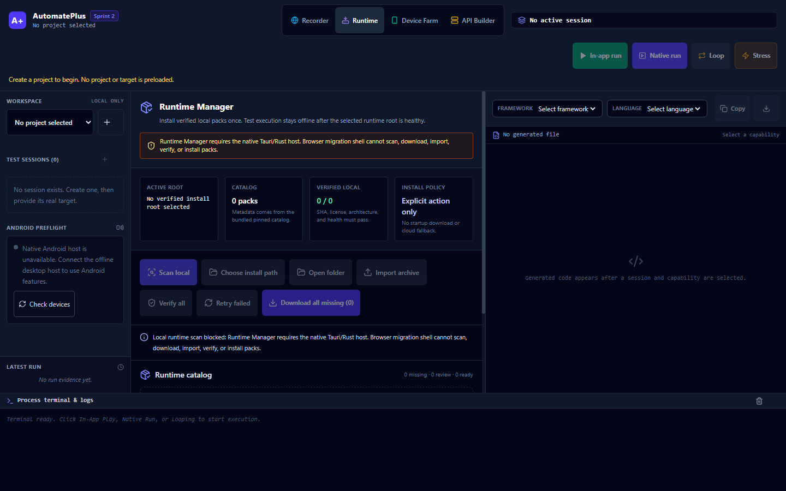
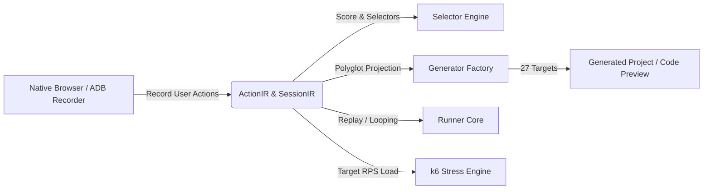

# AutomatePlus (Sprint 2) 🚀

[](https://github.com/Adrian463588/AutomatePlus)
[](https://github.com/Adrian463588/AutomatePlus)
[](https://github.com/Adrian463588/AutomatePlus)
[](https://github.com/Adrian463588/AutomatePlus)

> **AutomatePlus** is an offline-first Windows desktop platform for low-code multiplatform test automation. It bridges visual recording, unified intermediate representations (IR), and polyglot code generation across **Web**, **Android**, and **API** ecosystems.



Runtime Manager responsive previews: [390×844](docs/assets/runtime-manager-preview-390x844.png) · [600×900](docs/assets/runtime-manager-preview-600x900.png) · [768×1024](docs/assets/runtime-manager-preview-768x1024.png) · [840×1024](docs/assets/runtime-manager-preview-840x1024.png) · [1024×768](docs/assets/runtime-manager-preview-1024x768.png) · [1280×800](docs/assets/runtime-manager-preview-1280x800.png) · [1440×900](docs/assets/runtime-manager-preview-1440x900.png)

Responsive previews: [390×844](docs/assets/sprint-2-preview-390x844.png) · [600×900](docs/assets/sprint-2-preview-600x900.png) · [768×1024](docs/assets/sprint-2-preview-768x1024.png) · [840×1024](docs/assets/sprint-2-preview-840x1024.png) · [1024×768](docs/assets/sprint-2-preview-1024x768.png) · [1280×800](docs/assets/sprint-2-preview-1280x800.png) · [1440×900](docs/assets/sprint-2-preview-1440x900.png)

The previews are captured from the current built renderer in a fresh local browser profile. They show the truthful empty/blocked state: no project, target package, device, generated code, or synthetic run result is created until the user supplies real data and the native host provides it.

## Evidence and acceptance boundaries

The current component evidence includes 150 passing TypeScript tests across 27 test files, lint, format, typecheck, package/sidecar/React builds, documentation checks, the 27-combination generator matrix, sidecar capability smoke, a separately named loopback k6 fixture, and an authenticity scan. The target-named SauceDemo, DemoQA, ReqRes, Petstore, and NotiPlus suites in Vitest are fixture-bound component tests; they are not evidence that those external targets or physical devices were automated. Runtime Manager was rendered at `390x844`, `600x900`, `768x1024`, `840x1024`, `1024x768`, `1280x800`, and `1440x900`; each rendered document reported `scrollWidth === innerWidth`.

Native Tauri/Rust acceptance remains explicitly `Blocked` until the offline Cargo/Tauri dependency cache and verified runtime packs are available. Physical target preflight was run against two authorized devices with the installed NotiPlus package/activity and the real `Riwayat` semantic selector; AutomatePlus farm acceptance remains `Blocked` because the verified farm/Appium packs and native host IPC replay are not available. The React/Vite application is a browser-safe migration shell; it does not fabricate native runtime or device evidence.

### Sprint 2 Android device farm

Sprint 2 adds a local Windows device-farm contract without introducing cloud services:

- `single`, `all-devices`, and `split-iterations` replay strategies with bounded workers and one lease per ADB serial.
- Device profiles/groups with stable local IDs, serial snapshots, preflight, port leases, and per-device evidence.
- Primary/follower Android recording: one canonical `ActionIR`, independent follower locator observations, and explicit mismatch/review states.
- One generated project per framework/language with required per-device runtime context; no hard-coded serials or Appium ports.

Farm runtime acceptance requires at least two authorized physical devices, a real target package/activity, and checksum-verified offline Appium/UiAutomator2/scrcpy packs. Unit tests and browser-shell previews remain component/prototype evidence only.

---

## 📌 Project Overview

AutomatePlus empowers QA engineers, developers, and automation specialists to visually record, inspect, parameterize, and run tests without vendor lock-in. Instead of proprietary binary scripts, every recorded interaction translates into canonical, versioned JSON Intermediate Representation (`SessionIR` & `ActionIR`), which projects into **27 capability-checked framework/language combinations**. The production target is Tauri 2 + Rust with a versioned TypeScript sidecar and React renderer; ordinary browser mode remains a safe migration shell.

### Core Philosophy
1. **Low-Code Visual Recording**: Click-and-record interactions through the native headed browser and ADB device bridge.
2. **Canonical IR as Single Source of Truth**: The IR maintains semantic selectors, gesture coordinates, parameters, assertions, schema versions, and secret references. Generated code is a pure, deterministic projection.
3. **True Polyglot Multiplatform**: Generate capability-checked runnable project candidates for 5 Web frameworks, 4 Android frameworks, and 2 API runners across Python, TypeScript, JavaScript, Java, Kotlin, and YAML.
4. **Explicit Runtime Boundaries**: Host-side runners execute real local processes. Missing runtimes, devices, or project prerequisites are reported as `Blocked`; no simulator result is acceptance evidence.
5. **Offline & Secure by Design**: Runs entirely locally on Windows with zero cloud telemetry requirements and explicit `${secret.KEY}` credential isolation.

---

## 🛠️ Technology Stack

| Layer | Technologies |
|---|---|
| **Production Desktop GUI** | Tauri 2, Rust, WebView2, React 18 |
| **Native orchestration** | Rust ADB/Appium/scrcpy, SQLite, leases, ports, cancellation |
| **Renderer and sidecar** | TypeScript, Vite, Tailwind CSS, Zustand, versioned IPC |
| **Monorepo Architecture** | npm workspaces, TypeScript Project References |
| **Testing & Verification** | Vitest, Node.js, cargo fmt/check/test, Tauri offline preflight |
| **IR & Schema Validation** | Zod (v3.23) Schema Contracts |
| **Selector Engine** | Multi-attribute scoring algorithm (Test ID, Role, Text, CSS, XPath) |
| **Stress & Looping Engine** | k6 runner (constant-arrival-rate), interactive stepping looper |

---

## 🧩 Monorepo Workspace Structure

```text
AutomatePlus/
├── apps/
│   ├── desktop/                 # Browser-safe React/Vite migration shell
│   └── sidecar/                 # TypeScript NDJSON sidecar entrypoint
├── packages/
│   ├── contracts/               # Shared TypeScript interfaces & capability manifests
│   ├── ir-schema/               # Versioned ActionIR, SessionIR, and Zod schemas
│   ├── selector-engine/         # Robust selector scoring & fallback ranker
│   ├── generators/              # 27 capability-checked generators & GeneratorFactory
│   ├── persistence/             # Storage engines & repository abstractions
│   ├── recorder-web/            # Web browser interaction & CDP capture
│   ├── recorder-android/        # Android screencast & gesture capture
│   ├── runner-core/             # Interactive in-app player & process runner
│   └── stress-engine/           # Functional looper & k6 RPS load generator
├── docs/                        # Architecture & reference documentation
├── apps/desktop/src-tauri/      # Tauri 2 + Rust native host
├── src/                         # Legacy .NET source; not a release dependency
├── tests/                       # Legacy .NET tests; not a release gate
├── runtime-packs/               # Offline runtime manifest; no binaries committed
├── scripts/                     # Quality and loopback verification fixtures
├── Run-AutomatePlus.bat         # Root one-click offline launcher
├── AGENTS.md                    # Agent behavior & verification rules
├── DESIGN.md                    # System architecture specification
├── PRD.md                       # Product requirement document
├── package.json                 # Monorepo root configuration
└── tsconfig.json                # Base TypeScript configuration
```

---

## 🌐 Supported Automation Matrix (27 Generators)

AutomatePlus provides first-class code generation for the following frameworks and languages:

### 1. Web Automation
| Framework | TypeScript | JavaScript | Python | Java | Robot DSL |
|---|:---:|:---:|:---:|:---:|:---:|
| **Playwright** | ✅ | ✅ | ✅ | ✅ | — |
| **Cypress** | ✅ | ✅ | — | — | — |
| **Puppeteer** | ✅ | ✅ | — | — | — |
| **Selenium WebDriver** | ✅ | ✅ | ✅ | ✅ | — |
| **Robot Framework** | — | — | — | — | ✅ |

### 2. Android Mobile Automation
| Framework | Java | Kotlin | TypeScript | JavaScript | YAML |
|---|:---:|:---:|:---:|:---:|:---:|
| **Appium** | ✅ | ✅ | ✅ | ✅ | — |
| **Espresso** | ✅ | ✅ | — | — | — |
| **Robolectric** | ✅ | ✅ | — | — | — |
| **Maestro** | — | — | — | — | ✅ |

### 3. API Automation & Stress Testing
| Framework / Tool | TypeScript | JavaScript | Python | Java |
|---|:---:|:---:|:---:|:---:|
| **k6 RPS Load Generator** | — | ✅ | — | — |
| **HTTP Request Clients** | ✅ | ✅ | ✅ | ✅ |

---

## ⚡ Getting Started

### Prerequisites
- **Node.js**: `v20.x` or higher
- **npm**: `v10.x` or higher
- **OS**: Windows 10 / 11 (x64)

### Installation
Clone the repository and install all workspace dependencies:

```bash
# Clone the repository
git clone https://github.com/Adrian463588/AutomatePlus.git

# Navigate to project directory
cd AutomatePlus

# Install the locked dependency graph without network access
npm ci --offline
```

---

## 🚀 Running & Building

### 1. Run Desktop Application (Development Mode)
Start the browser-safe migration shell. It is safe for editing and API fixtures; native Android/device actions remain Blocked without Tauri:
```bash
npm run dev:desktop
```
Open your browser at `http://127.0.0.1:5173` to interact with the GUI.

For the official one-click offline desktop path, double-click `Run-AutomatePlus.bat` or `automate-plus.bat` in the repository root. The default path is native-only and fails closed with a diagnostic when the published `AutomatePlus.exe`, verified packs, or Tauri toolchain are unavailable. The launcher never downloads or installs a dependency. Pass `--browser` explicitly to start the migration shell; browser mode is not native acceptance. Pass `--doctor` for JSON preflight diagnostics.

### Runtime Manager and offline distribution

The `Runtime` header button is implemented in the native Tauri/Rust host. It scans only the selected project root, the workspace root, `%LOCALAPPDATA%`, `%ProgramData%`, and bundled resources. `Scan local`, `Choose install path`, `Import archive`, `Verify all`, `Retry failed`, `Cancel`, and `Open folder` are real native actions; the browser migration shell keeps them disabled with an explicit reason.

Runtime download is opt-in twice: the user accepts the license dialog and starts the action, and the process has `AUTOMATEPLUS_RUNTIME_DOWNLOAD=1`. There is no startup download, remote catalog fetch, hidden installer, telemetry, or cloud fallback:

```powershell
$env:AUTOMATEPLUS_RUNTIME_DOWNLOAD = '1'
# Start AutomatePlus natively, open Runtime, review the catalog, then click Download all missing.
.\automate-plus.bat
```

After installation, execution resolves only checksum-verified local packs and health evidence. Exact `id + version + source SHA-256` matches are reused; different hashes become `NeedsReview` and are never overwritten automatically. `runtime-packs/catalog.json` is metadata-only until an official artifact has a pinned version, HTTPS URL, size, SHA-256, license, executable allowlist, and health command. Run `npm run verify:runtime-catalog` and `npm run verify:offline-install` to see the current status. The current checkout deliberately reports `NeedsReview/Blocked` because those verified release artifacts and the offline Cargo/`cargo-tauri` cache are not present.

The release verifier expects `release/AutomatePlus.exe`, `release/AutomatePlusBootstrap.exe`, `release/WebView2RuntimeInstallerX64.exe`, and the catalog. It writes `release/release-manifest.json` only after hashing every artifact from disk:

```powershell
npm run verify:release-manifest
npm run native:preflight
```

### 2. Build Monorepo Packages
Compile all internal TypeScript packages:
```bash
npm run build:packages
npm run build:sidecar
```

### 3. Build Desktop Application Bundle
Compile the renderer with npm run build:desktop. Build the offline native package with npm run native:build after the local Tauri CLI, Cargo cache, WebView2, and verified packs are present:
```bash
npm run build:desktop
```

### 4. Run Automated Test Suite
Execute unit and integration test suites across all packages:
```bash
npm test

# Quality gates
npm run lint
npm run format:check
npm run typecheck
npm run verify:docs
npm run verify:sidecar
npm run verify:generators
npm run verify:ui-contract
npm run verify:k6:fixture # component-only loopback fixture
npm run verify:k6         # explicit target-online k6 gate; Blocked without verified k6 pack
npm run verify:runtime-catalog
npm run verify:runtime-manager
npm run verify:offline-install
npm run verify:release-manifest
```

### 5. Explicit target-online and physical-device gates

The control plane remains offline. These commands intentionally access only the named public targets after an explicit opt-in; they do not download dependencies, log in, or emit credentials:

```powershell
$env:AUTOMATEPLUS_ONLINE_E2E = '1'
# Set AUTOMATEPLUS_REQRES_API_KEY from the local secret store before this command.
npm run e2e:online
npm run verify:k6

$env:AUTOMATEPLUS_ANDROID_E2E = '1'
npm run e2e:android
```

`e2e:online` records response status, shape, timing, and hashes without persisting response bodies. ReqRes is `Blocked` until its current `x-api-key` credential is supplied. `e2e:android` discovers serials at runtime, validates `com.notifplus/.MainActivity`, captures the real hierarchy on every authorized device, and uses only an observed `Riwayat` text/content-description locator. Raw ADB checks do not count as native farm acceptance. Evidence is written to the ignored `.automateplus/evidence/` directory.

---

## 📖 User Workflow Guide



1. **Recording Actions**:
   - Select a Web or Android session and start the native recorder.
   - The host captures clicks, taps, text inputs, scrolls, swipes, and drag-and-drop gestures; unavailable runtimes/devices remain `Blocked`.
   - Add an assertion explicitly to insert a validation checkpoint.
2. **Reviewing the Timeline**:
   - Inspect recorded steps in the **Action Sequence Timeline**.
   - Reorder steps using drag controls or arrow buttons.
   - Configure secrets using `${secret.KEY}` placeholders to protect sensitive credentials.
3. **Polyglot Code Viewer**:
   - Switch between **Playwright**, **Cypress**, **Selenium**, **Puppeteer**, **Robot Framework**, **Appium**, **Espresso**, **Maestro**, and **k6**.
   - Select the target language (**TypeScript**, **JavaScript**, **Python**, **Java**, **Kotlin**, or **YAML**).
   - Inspect the generated project manifest and code preview; `Ready` is only shown after formatter, lint, compile/typecheck, and local smoke gates pass.
4. **Running Tests & Stress Looping**:
   - **Functional Run**: Host-provided step execution with live log streaming; the migration shell reports `Blocked` for host-only actions.
   - **Native Run**: Isolated OS process execution using the local framework runtime.
   - **Loop Test**: Perform functional soak testing with customizable iteration counts.
   - **Android Phone Farm**: Replay tests across connected devices concurrently with `all-devices` (replicate) or `split-iterations` (distributed) strategies, atomic per-device locking, dynamic port allocation, and normalized per-device reports.
   - **RPS Stress**: Configure target RPS and duration in the **k6 Stress Modal** to benchmark backend throughput.

---

## 🛡️ Security & Privacy

- **No Plaintext Secrets**: Passwords, API tokens, and private keys use `SecretRef` objects (`${secret.KEY}`) that resolve securely at runtime.
- **Process Isolation**: Command execution strictly uses allowlisted executables and argument arrays (preventing shell injection).
- **Offline First**: The native Tauri/Rust host owns SQLite, device leases, farm evidence, process state, and cleanup; the browser migration shell uses browser-safe local storage and remains non-production native evidence.
- **Truthful acceptance**: Component gates may pass locally, while native Tauri and physical Android remain Blocked until Cargo/Tauri, verified packs, a target app, and the required real devices are available.

---

## ✍️ Author & Signature

**Created by Adrian Syah Abidin**

*AutomatePlus — Next-Generation Low-Code Multiplatform Test Automation & Polyglot Generator Platform.*
