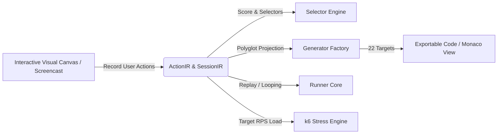

# AutomatePlus (v2) 🚀

[](https://github.com/Adrian463588/AutomatePlus)
[](https://github.com/Adrian463588/AutomatePlus)
[](https://github.com/Adrian463588/AutomatePlus)
[](https://github.com/Adrian463588/AutomatePlus)

> **AutomatePlus** is an offline-first Windows desktop platform for low-code multiplatform test automation. It bridges visual recording, unified intermediate representations (IR), and polyglot code generation across **Web**, **Android**, and **API** ecosystems.

---

## 📌 Project Overview

AutomatePlus empowers QA engineers, developers, and automation specialists to visually record, inspect, parameterize, and run tests without vendor lock-in. Instead of proprietary binary scripts, every recorded interaction translates into canonical, versioned JSON Intermediate Representation (`SessionIR` & `ActionIR`), which dynamically projects into **22 framework/language combinations** in real time.

### Core Philosophy
1. **Low-Code Visual Recording**: Click-and-record interactions on Web canvases and Android device screencasts.
2. **Canonical IR as Single Source of Truth**: The IR maintains semantic selectors, gesture coordinates, parameters, and secret references. Generated code is a pure, deterministic projection.
3. **True Polyglot Multiplatform**: Generate production-ready code for 5 Web frameworks, 4 Android frameworks, and 2 API runners across Python, TypeScript, JavaScript, Java, Kotlin, and YAML.
4. **End-to-End Execution & Load Looping**: Run tests in-app step-by-step, run process-isolated native frameworks, perform soak looping for UI resilience, or execute constant-arrival-rate RPS stress testing with k6.
5. **Offline & Secure by Design**: Runs entirely locally on Windows with zero cloud telemetry requirements and explicit `${secret.KEY}` credential isolation.

---

## 🛠️ Technology Stack

| Layer | Technologies |
|---|---|
| **Desktop GUI** | React 18, Vite, TypeScript, Tailwind CSS, Zustand, Lucide Icons |
| **Monorepo Architecture** | npm workspaces, TypeScript Project References |
| **Testing & Verification** | Vitest, Node.js v20+ Test Runners |
| **IR & Schema Validation** | Zod (v3.23) Schema Contracts |
| **Selector Engine** | Multi-attribute scoring algorithm (Test ID, Role, Text, CSS, XPath) |
| **Stress & Looping Engine** | k6 runner (constant-arrival-rate), interactive stepping looper |

---

## 🧩 Monorepo Workspace Structure

```text
AutomatePlus/
├── apps/
│   └── desktop/                 # React + Vite desktop UI & bridge
│       ├── src/
│       │   ├── components/      # VisualCanvas, ActionTimeline, MonacoView, ApiBuilder, StressModal
│       │   ├── store/           # Zustand state management (appStore.ts)
│       │   └── services/        # Desktop bridge & IPC services
├── packages/
│   ├── contracts/               # Shared TypeScript interfaces & capability manifests
│   ├── ir-schema/               # Versioned ActionIR, SessionIR, and Zod schemas
│   ├── selector-engine/         # Robust selector scoring & fallback ranker
│   ├── generators/              # 22 Polyglot code generators & GeneratorFactory
│   ├── persistence/             # Storage engines & repository abstractions
│   ├── recorder-web/            # Web browser interaction & CDP capture
│   ├── recorder-android/        # Android screencast & gesture capture
│   ├── runner-core/             # Interactive in-app player & process runner
│   └── stress-engine/           # Functional looper & k6 RPS load generator
├── docs/                        # Architecture & reference documentation
├── AGENTS.md                    # Agent behavior & verification rules
├── DESIGN.md                    # System architecture specification
├── PRD.md                       # Product requirement document
├── package.json                 # Monorepo root configuration
└── tsconfig.json                # Base TypeScript configuration
```

---

## 🌐 Supported Automation Matrix (22 Generators)

AutomatePlus provides first-class code generation for the following frameworks and languages:

### 1. Web Automation
| Framework | TypeScript | JavaScript | Python | Java | Robot DSL |
|---|:---:|:---:|:---:|:---:|:---:|
| **Playwright** | ✅ | ✅ | ✅ | ✅ | — |
| **Cypress** | ✅ | ✅ | — | — | — |
| **Puppeteer** | ✅ | ✅ | — | — | — |
| **Selenium WebDriver** | ✅ | ✅ | ✅ | ✅ | — |
| **Robot Framework** | — | — | — | — | ✅ |

### 2. Android Mobile Automation
| Framework | Java | Kotlin | TypeScript | JavaScript | YAML |
|---|:---:|:---:|:---:|:---:|:---:|
| **Appium** | ✅ | ✅ | ✅ | ✅ | — |
| **Espresso** | ✅ | ✅ | — | — | — |
| **Robolectric** | ✅ | ✅ | — | — | — |
| **Maestro** | — | — | — | — | ✅ |

### 3. API Automation & Stress Testing
| Framework / Tool | TypeScript | JavaScript | Python | Java |
|---|:---:|:---:|:---:|:---:|
| **k6 RPS Load Generator** | — | ✅ | — | — |
| **HTTP Request Clients** | ✅ | ✅ | ✅ | ✅ |

---

## ⚡ Getting Started

### Prerequisites
- **Node.js**: `v20.x` or higher
- **npm**: `v10.x` or higher
- **OS**: Windows 10 / 11 (x64)

### Installation
Clone the repository and install all workspace dependencies:

```bash
# Clone the repository
git clone https://github.com/AdrianSyahAbidin/AutomatePlus.git

# Navigate to project directory
cd AutomatePlus

# Install dependencies across all workspaces
npm install
```

---

## 🚀 Running & Building

### 1. Run Desktop Application (Development Mode)
Start the Vite development server for the desktop UI:
```bash
npm run dev:desktop
```
Open your browser at `http://localhost:5173` to interact with the GUI.

### 2. Build Monorepo Packages
Compile all 9 internal TypeScript packages:
```bash
npm run build:packages
```

### 3. Build Desktop Application Bundle
Compile and bundle the production desktop app:
```bash
npm run build:desktop
```

### 4. Run Automated Test Suite
Execute unit and integration test suites across all packages:
```bash
npm test
```

---

## 📖 User Workflow Guide



1. **Recording Actions**:
   - Navigate to the **Web Canvas** or **Android Mirror** tab.
   - Click **Record Actions** to capture clicks, taps, text inputs, scrolls, swipes, and drag-and-drop gestures.
   - Click **Assert** to insert validation checkpoints for element visibility, text matching, and attributes.
2. **Reviewing the Timeline**:
   - Inspect recorded steps in the **Action Sequence Timeline**.
   - Reorder steps using drag controls or arrow buttons.
   - Configure secrets using `${secret.KEY}` placeholders to protect sensitive credentials.
3. **Polyglot Code Viewer**:
   - Switch between **Playwright**, **Cypress**, **Selenium**, **Puppeteer**, **Robot Framework**, **Appium**, **Espresso**, **Maestro**, and **k6**.
   - Select the target language (**TypeScript**, **JavaScript**, **Python**, **Java**, **Kotlin**, or **YAML**).
   - Click **Copy** or **Download** to export the ready-to-run test script.
4. **Running Tests & Stress Looping**:
   - **In-App Play**: Step-by-step interactive visual playback with live log streaming.
   - **Native Run**: Isolated OS process execution using the local framework runtime.
   - **Loop Test**: Perform functional soak testing with customizable iteration counts.
   - **RPS Stress**: Configure target RPS and duration in the **k6 Stress Modal** to benchmark backend throughput.

---

## 🛡️ Security & Privacy

- **No Plaintext Secrets**: Passwords, API tokens, and private keys use `SecretRef` objects (`${secret.KEY}`) that resolve securely at runtime.
- **Process Isolation**: Command execution strictly uses allowlisted executables and argument arrays (preventing shell injection).
- **Offline First**: All sessions, selector rankings, code generation, and logs are persisted to local storage.

---

## ✍️ Author & Signature

**Created by Adrian Syah Abidin**

*AutomatePlus — Next-Generation Low-Code Multiplatform Test Automation & Polyglot Generator Platform.*
