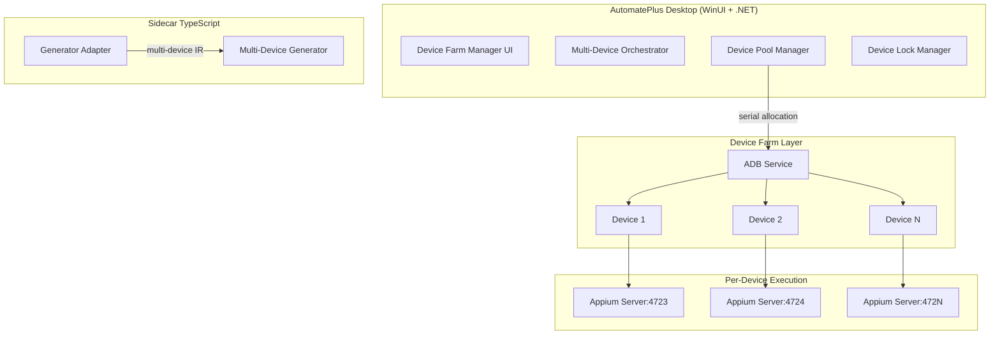

Untuk melanjutkan pengembangan AutomatePlus ke Sprint 2 dengan fitur multi-device Android, saya akan memberikan rekomendasi stack dan panduan implementasi berdasarkan praktik terbaik, merujuk pada arsitektur yang telah ditetapkan di `DESIGN.md` dan `PRD.md`.

---

## Ringkasan Eksekutif Sprint 2

Sprint 2 berfokus pada perluasan kemampuan Android dari single-device menjadi **multi-device orchestration**. Dua fitur utama yang ditambahkan:

1. **Replay berulang pada multiple device** (Android device farm)
2. **Record dan generate code untuk multiple device**

Prinsip yang dipegang: **SOLID, DRY, YAGNI, KISS**, dan tetap **offline-first** di Windows desktop.

---

## Rekomendasi Stack untuk Sprint 2

### Arsitektur Multi-Device

Berdasarkan referensi dari implementasi production-grade seperti di Halodoc  dan Appium Parallel Runner , arsitektur multi-device yang direkomendasikan:



### Stack Recommendations

| Layer | Technology | Justification |
|-------|------------|---------------|
| **Device Pool Manager** | C# (.NET 8) + `System.Diagnostics.Process` | Kontrol penuh atas proses ADB/Appium, konsisten dengan arsitektur existing  |
| **Device Discovery** | ADB via `adb devices -l` | Standar Android, mendukung discovery real device & emulator |
| **Parallel Execution** | .NET `Parallel.ForEach` + `SemaphoreSlim` | Resource-constrained parallelism, thread-safe device allocation |
| **Appium Server Management** | `AppiumDriverLocalService` (Java) atau `appium` CLI via process | Setiap device butuh Appium server di port unik  |
| **Multi-Device IR** | JSON Schema extension | Tambahkan `targetDevices: DeviceSelector[]` ke `AutomationSession` |
| **Code Generation** | TypeScript sidecar, multi-device template | Generator menghasilkan kode dengan `ThreadLocal<AndroidDriver>` pattern  |

---

## Step-by-Step Implementasi Sprint 2

### Fase 1: Device Pool Manager (Foundation)

**Tujuan**: Manajemen device Android yang aman untuk multi-thread.

**Implementasi**:

```csharp
// AutomatePlus.Domain/Devices/DevicePool.cs
public class DevicePool : IDevicePool
{
    private readonly ConcurrentDictionary<string, DeviceSlot> _slots = new();
    private readonly SemaphoreSlim _allocationSemaphore;
    
    public async Task<DeviceSlot> AcquireDeviceAsync(DeviceRequirements requirements, CancellationToken ct)
    {
        // 1. Discovery via ADB
        var devices = await _adbService.ListDevicesAsync(ct);
        
        // 2. Filter by requirements (model, API level, availability)
        var eligible = devices.Where(d => d.State == DeviceState.Online 
            && !_slots.Values.Any(s => s.Device.Serial == d.Serial && s.IsLocked))
            .ToList();
        
        // 3. Allocate dengan resource-aware scheduling
        var selected = await _scheduler.SelectOptimalDeviceAsync(eligible);
        var slot = new DeviceSlot(selected);
        _slots.TryAdd(Guid.NewGuid().ToString(), slot);
        return slot;
    }
    
    public void ReleaseDevice(string slotId)
    {
        if (_slots.TryRemove(slotId, out var slot))
        {
            slot.Release();
        }
    }
}
```

**Design Pattern**: **Pool Pattern** dengan **Resource Monitor** untuk memastikan resource CPU/memory tidak overload.

**Referensi**: DevicePool management pada Appium Parallel Runner  dan VTS multi-device allocation .

---

### Fase 2: Multi-Device Orchestrator

**Tujuan**: Menjalankan test yang sama pada multiple device secara paralel.

**Implementasi**:

```csharp
// AutomatePlus.Application/Orchestration/MultiDeviceOrchestrator.cs
public class MultiDeviceOrchestrator : IMultiDeviceOrchestrator
{
    public async Task<MultiDeviceRunResult> RunAsync(
        AutomationSession session, 
        MultiDeviceRunOptions options,
        CancellationToken ct)
    {
        // 1. Validasi device requirements dari session
        var devices = await _devicePool.AcquireDevicesAsync(options.DeviceCount, ct);
        
        // 2. Parallel execution dengan bounded parallelism
        var parallelOptions = new ParallelOptions 
        { 
            MaxDegreeOfParallelism = options.MaxConcurrentDevices,
            CancellationToken = ct 
        };
        
        var results = new ConcurrentBag<DeviceRunResult>();
        
        await Parallel.ForEachAsync(devices, parallelOptions, async (device, token) =>
        {
            // 3. Setup per-device environment
            var appiumServer = await _appiumService.StartServerAsync(device, token);
            var driver = await _appiumService.CreateDriverAsync(device, appiumServer, token);
            
            // 4. Run test on this device
            var runResult = await _testExecutor.RunAsync(session, driver, token);
            results.Add(runResult);
            
            // 5. Cleanup
            await driver.QuitAsync();
            await appiumServer.StopAsync();
        });
        
        return new MultiDeviceRunResult(devices, results);
    }
}
```

**Best Practice**:
- Gunakan **`ThreadLocal<AndroidDriver>`** untuk thread-safety 
- Setiap device memiliki **Appium server di port unik** (e.g., 4723, 4724, ...) 
- Implementasikan **graceful shutdown** - jika satu device gagal, device lain tetap jalan 

---

### Fase 3: Multi-Device Recorder

**Tujuan**: Record actions dari multiple device secara bersamaan.

**Implementasi**:

```csharp
// AutomatePlus.Application/Recorders/MultiDeviceRecorder.cs
public class MultiDeviceRecorder : IMultiDeviceRecorder
{
    public async IAsyncEnumerable<RecordedAction> StartRecordingAsync(
        IEnumerable<DeviceSlot> devices,
        [EnumeratorCancellation] CancellationToken ct)
    {
        // 1. Start recording on all devices in parallel
        var recordingTasks = devices.Select(device => 
            RecordSingleDeviceAsync(device, ct)).ToList();
        
        // 2. Stream events with device attribution
        await foreach (var action in MergeStreamsAsync(recordingTasks, ct))
        {
            // 3. Annotate action with device metadata
            action.DeviceMetadata = new DeviceMetadata
            {
                Serial = action.Device.Serial,
                Model = action.Device.Model,
                ApiLevel = action.Device.ApiLevel
            };
            yield return action;
        }
    }
}
```

**Best Practice**:
- Setiap device recording stream di-**merge** dengan device attribution
- Action IR diperluas dengan field `targetDevices: DeviceSelector[]` untuk multi-device code generation 

---

### Fase 4: Multi-Device Code Generator

**Tujuan**: Generate code yang support parallel execution pada multiple device.

**Implementasi** (TypeScript sidecar):

```typescript
// sidecar/src/generators/android-multi-device.ts
export class MultiDeviceGenerator implements ICodeGenerator {
    generate(session: AutomationSession, options: GenerateOptions): GeneratedProject {
        const devices = session.targetDevices || [];
        
        // 1. Generate base test dengan ThreadLocal pattern
        const testContent = this.generateThreadSafeTest(session, devices);
        
        // 2. Generate DevicePool manager (copy from template)
        const poolContent = this.generateDevicePool(devices);
        
        // 3. Generate TestNG XML for parallel execution
        const suiteContent = this.generateTestNGSuit(devices);
        
        return {
            files: [
                { path: 'src/test/java/BaseTest.java', content: testContent },
                { path: 'src/main/java/DevicePool.java', content: poolContent },
                { path: 'testng.xml', content: suiteContent }
            ]
        };
    }
    
    private generateThreadSafeTest(session: AutomationSession, devices: DeviceSelector[]): string {
        // Template menggunakan ThreadLocal<AndroidDriver>
        return `
public class BaseTest {
    private static ThreadLocal<AndroidDriver> driver = new ThreadLocal<>();
    
    @BeforeMethod
    public void setup() {
        // Setup driver per thread
        AndroidDriver driverInstance = new AndroidDriver(...);
        driver.set(driverInstance);
    }
    
    @AfterMethod
    public void teardown() {
        if (driver.get() != null) {
            driver.get().quit();
        }
    }
}
        `;
    }
}
```

**Referensi**: ThreadLocal pattern dari TestGrid  dan Halodoc implementation .

---

### Fase 5: Device Farm UI

**Tujuan**: Visual management multiple devices.

**UI Components** (WinUI 3):
1. **Device Grid**: Menampilkan semua device yang terdeteksi (status, model, API level)
2. **Device Allocation Control**: Pilih device untuk test (checklist)
3. **Parallel Run Dashboard**: Progress per device, status, logs
4. **Device Health Monitor**: CPU, memory, battery per device

**Inspirasi**: STF (Smartphone Test Farm) UI 

---

## Top 5 Repository Android Referensi

Berikut 5 repository GitHub terbaik untuk referensi multi-device Android automation:

| # | Repository | Key Features | Alasan Dipilih |
|---|------------|--------------|----------------|
| 1 | **[DeviceFarmer/stf](https://github.com/DeviceFarmer/stf)** | Web-based Android device farm, remote control, multi-device management  | **Acuan utama** untuk device farm architecture; 13.5k+ stars; proven production use |
| 2 | **[sc-tina/appium-parallel-runner](https://github.com/sc-tina/appium-parallel-runner)** | Parallel test execution, auto-discovery, thread-safe device pool  | **Best practice pattern** untuk parallel execution dengan device pool |
| 3 | **[zebrunner/mcloud](https://github.com/zebrunner/mcloud)** | Mobile farm ecosystem, Appium grid, video recording, device provisioning  | **Complete ecosystem** untuk mobile device farm; integrated reporting |
| 4 | **[alipay/SoloPi](https://github.com/alipay/SoloPi)** | Android automation recorder, multi-device sync, performance monitoring  | **Mobile recorder reference** - action recording dan replay pada multiple devices |
| 5 | **[userasad/Remote-Device-Farm](https://github.com/userasad/Remote-Device-Farm)** | ADB remote device lab, scrcpy integration, multi-client support  | **Simple, practical** implementasi remote device farm untuk Windows |

---

## Quality Gates untuk Sprint 2

| Gate | Command | Verification |
|------|---------|--------------|
| Device Discovery | `adb devices -l` | Minimal 2 devices detected |
| Parallel Execution | `dotnet test --filter "Category=MultiDevice"` | Tests pass in parallel |
| Thread-Safety | Static analysis + integration test | No `NullReferenceException` in parallel runs |
| Resource Cleanup | Process tree inspection after cancel | All Appium/ADB processes terminated |
| Code Lint | `dotnet format --verify-no-changes` + `npm run lint` | Zero violations |
| IR Schema Extension | `npm run schema:validate` | Multi-device IR valid |

---

## Risk Mitigation

| Risk | Mitigation |
|------|------------|
| **Resource contention** | Implement `SemaphoreSlim` untuk membatasi parallelism berdasarkan CPU/memory  |
| **Port conflict** | Auto-assign Appium port dari range 4723-4823  |
| **Thread-safety issue** | Gunakan `ConcurrentDictionary` dan `ThreadLocal` pattern  |
| **Device disconnection mid-run** | Implement `retry` dengan device re-acquisition  |
| **Test flakiness** | Setiap test isolated dengan unique test data per thread  |

---

## Resume

Sprint 2 dapat diimplementasikan dengan **memperluas arsitektur existing** tanpa breaking change:

1. **Extend** `DeviceService` menjadi `DevicePool` dengan thread-safe allocation 
2. **Extend** `TestRunner` menjadi `MultiDeviceRunner` dengan parallel execution 
3. **Extend** `Recorder` menjadi `MultiDeviceRecorder` dengan stream merge
4. **Extend** `Generator` dengan multi-device templates (ThreadLocal pattern) 

Prinsip **YAGNI** dan **KISS** dijaga dengan hanya menambah fitur yang diperlukan, tidak over-engineering. Semua tetap **offline-first** karena device farm berjalan di local Windows machine dengan ADB .